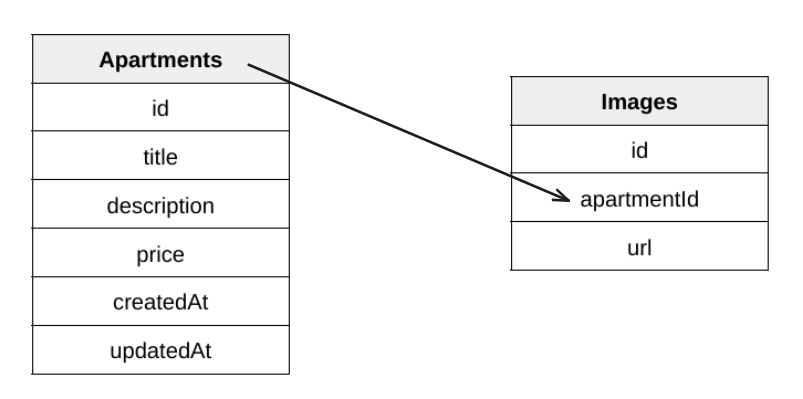

# AptFinder

A simple listing apartments app, enables users to view list of apartments, view details of a certain apartment and to add is apartment.

This project marks my first experience with Next.js for frontend and React Native for Mobile Application.

## Backend

### Tech Stack

- Language: TypeScript
- Framework: Node.js with Express
- Database: PostgreSQL with Sequelize ORM
- Deployment: Docker, Docker Compose
- Cloud Storage: Cloudinary (for image storage)

### Database Schema

## Frontend

### Tech Stack

- Framework: Next.js
- Language: JavaScript

## Mobile

### Tech Stack

- Framework: React Native
- Language: JavaScript
- Deployment: Expo Client (for testing)

## Running Backend, Frontend and Database with Docker Compose

- You need docker and docker-compose to be installed on your machine
- Modify .env.example files to include the required data
- Run `docker-compose up --build`
- Your backend should be accessible at http://localhost:5000 and frontend at http://localhost:3000.
